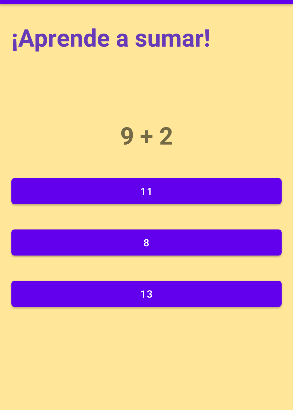

## Aprender a sumar
Pequeño juego para niños para aprender a sumar.

El juego muestra una suma simple de dos números aleaotorios de una cifra.
Si la respuesta es correcta :heavy_check_mark: se escuchará un sonido y si la respuesta es incorrecta :x: se reproducirá otro.

Aplicación que formó parte de los proyectos a entregar durante el curso, realizado en Android Studio en Java.

